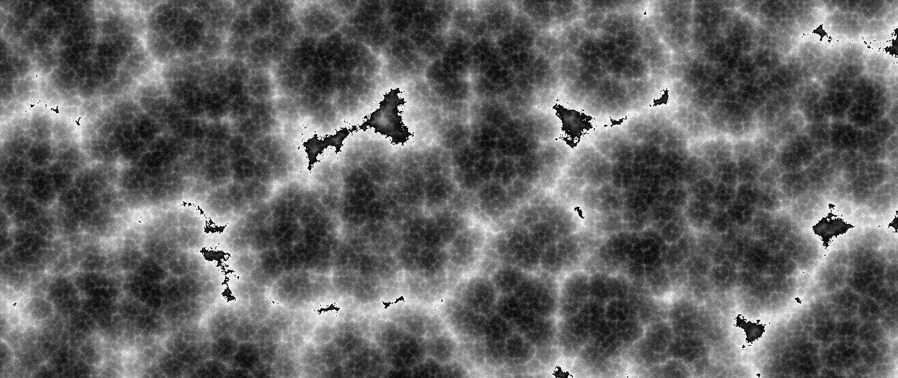

# DUST was a simple framework made for visualising noise generation but eventually just became a way to make cool (I think) images.
It utilises the PyPi module pyfastnoisesimd, the Python Imaging Library (PIL), numpy, and various other builtin modules that come with python 3.

#To run:
1. Clone this repository 
2. Install the pip modules "pyfastnoisesimd" and "PIL" (of course a virtual environment can be used), and
3. Run main.py with a recent version of python 3 (`$ python3 main.py`)

#To fiddle:
If you're looking to mess around with this I'm afraid you'll have to look at the source. I haven't made any proper documentation.
There will be comments, but I give no guarantee that they will be up-to-date or even relevant at all so expect to delve into the source ;)
To get started it is good to know that the provided main.py should work out of the box - if it doesn't your environment is incorrectly configured.

#Sample Images
The LandFilter is currently the only filter used in this section and the conditions used to generate each respective image are lost to time :)

